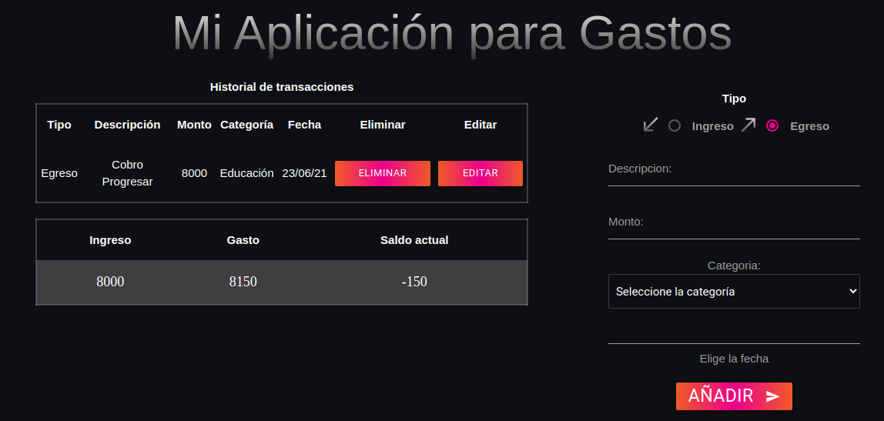

## My Expeses App

A web application to control your expenses.

## Table of contents

- [General info](#general-info)
- [Screenshots](#screenshots)
- [Technologies](#technologies)
- [Contact](#contact)

## General info

A web application to control your expenses. Records income and money expenses.

You can check my other branch *frontest* to see a full frontend version of the app

*Originally the backend of this app was done in Flask, but later it was changed to Node.js*

## Screenshots

## Technologies

- Html
- Css
- Javascript
- Nodejs
- MySQL

## view project

[expenses app](https://retalazycodes.github.io/my-expenses-app/front/)

## Contact

Created by [@retaLazyCodes](https://github.com/retaLazyCodes) - feel free to contact me!

